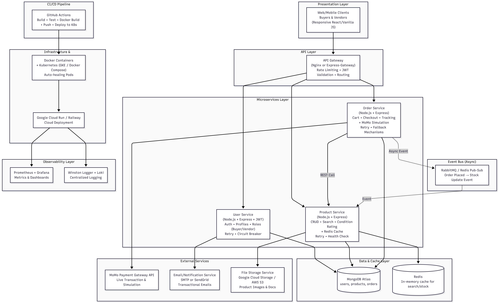

  Detailed Component-by-Component Explanation (Professional Narrative for Your Proposal and Final Report)
1 Presentation Layer
Buyers and vendors interact via a responsive single-page web application (mobile-first design optimized for Ugandan 2G/3G/4G networks). All requests are routed through the API Gateway. This layer is kept lightweight so the focus remains on backend microservices.

2 API Gateway Layer
A dedicated API Gateway (implemented with Nginx for simplicity or Express-Gateway) acts as the single entry point. It handles:

Request routing and load balancing
Rate limiting (prevents abuse during peak mitumba sales)
JWT token validation (centralized security)
CORS and request transformation

Why added? This is a 2026 cloud-native best practice that decouples clients from internal services, improves security, and simplifies client code — exactly what professional marketplaces (Jumia, Amazon) use.

3 Microservices Layer (The Three Core Services)
Each service is independently developed, containerized, and deployable (satisfying the “at least three microservices” requirement).

User Service (Week 3): Manages authentication, registration, profiles, and Buyer/Vendor roles using JWT. Stores data in MongoDB Atlas. Communicates with Order Service for profile verification during checkout.

Product Service (Week 4): Handles CRUD operations, advanced search/filter (size, brand, condition rating, price), and photo uploads. Uses Redis caching for hot products and search results (dramatically improves response time for popular mitumba items).

Order Service (Week 5): Manages cart, order placement (MoMo simulation), status tracking, and WhatsApp sharing. Calls Product Service synchronously for stock checks and publishes async events (via RabbitMQ/Redis Pub-Sub) when an order is placed so Product Service can update stock atomically.

Inter-service Communication

Synchronous REST/HTTP for immediate needs (Order → Product stock check).
Asynchronous events for decoupling (Order Placed event → Product Service reduces inventory). This prevents cascading failures and follows modern event-driven e-commerce patterns.

4 Data & Cache Layer

MongoDB Atlas (single cloud database as required): Shared cluster with separate collections for users, products, and orders. Provides automatic backups, scalability, and global access (perfect for Arua/Kampala users).
Redis (in-memory cache): Caches frequent product searches and stock levels. Deployed as a lightweight Docker container or Upstash free tier. Dramatically reduces database load during high-traffic periods (e.g., weekend mitumba rushes).

5 Event Bus
Lightweight RabbitMQ (CloudAMQP free tier) or Redis Pub-Sub handles asynchronous events. This adds resilience: if Product Service is temporarily down, orders can still be placed and stock updated later.

6 Observability Layer

Prometheus + Grafana: Real-time metrics (CPU, request latency, error rates) with custom dashboards (e.g., “Orders per hour in Owino Market”).
Winston + Loki: Centralized logging across all services. Logs are searchable and correlated by trace ID.

This fulfills the “logging and monitoring” requirement at a professional level.

7 Infrastructure & Orchestration Layer

Docker: Every service (including Redis and Gateway) runs in its own container with multi-stage Dockerfiles for security and small image size.
Kubernetes: Full orchestration using Kubernetes manifests (or Helm for advanced). Deployed to Google Kubernetes Engine (GKE) free tier or Railway/Docker Compose for local testing. Kubernetes provides auto-scaling, self-healing, rolling updates, and service discovery — far superior to simple Docker Compose and matches the assignment’s “container orchestration environment” option perfectly.

8 CI/CD Pipeline
GitHub Actions workflow:

Lint & test each service
Build Docker images
Push to Docker Hub
Deploy to Kubernetes (kubectl apply or ArgoCD style)  